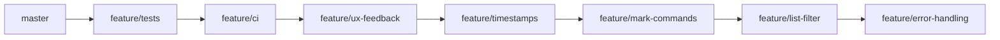

# Feature Branch Plan — Task Tracker CLI

Comparing the [spec](file:///home/scumpc/Dev/task-tracker/spec.md) against the current codebase, here's what's **done** and what's **missing**:

| Feature | Spec Requirement | Status |
|---|---|---|
| `add` command | ✅ | Done |
| `delete` command | ✅ | Done |
| `update` command (description) | Spec uses **positional arg**, you use `--description` flag | ⚠️ Differs |
| `mark-in-progress` command | `task-cli mark-in-progress 1` | ❌ Missing |
| `mark-done` command | `task-cli mark-done 1` | ❌ Missing |
| `list` with status filter | `task-cli list done` / `list todo` / `list in-progress` | ❌ Missing |
| UX feedback messages | `"Task added successfully (ID: 1)"` | ❌ Missing |
| `createdAt` / `updatedAt` fields | Required on Task model | ❌ Missing |
| Error handling | Graceful errors for invalid IDs, edge cases | ❌ Missing |

---

## Proposed Feature Branches

### Branch 0: `feature/tests`
**Goal:** Set up test infrastructure and write tests for existing functionality. Tests are expanded in each subsequent branch.

#### [MODIFY] [pyproject.toml](file:///home/scumpc/Dev/task-tracker/pyproject.toml)
- Add `pytest` as a dev dependency

#### [MODIFY] [test_main.py](file:///home/scumpc/Dev/task-tracker/tests/test_main.py)
- CLI integration tests using Typer's `CliRunner` — test `add`, `list`, `delete`, `update` commands

#### [NEW] [test_service.py](file:///home/scumpc/Dev/task-tracker/tests/test_service.py)
- Unit tests for `add_task()`, `get_tasks()`, `delete_task()`, `update_task()`
- Use `tmp_path` fixture to isolate test data from real data

> [!IMPORTANT]
> Each subsequent branch should **add tests** for its new features before merging. This branch sets up the foundation.

---

### Branch 1: `feature/ux-feedback`
**Goal:** Add confirmation messages to all commands.

#### [MODIFY] [service.py](file:///home/scumpc/Dev/task-tracker/src/task_cli/service.py)
- `add_task()` returns `Task` instead of `None`, so CLI can print the ID
- `delete_task()` returns `bool` or raises error if ID not found
- `update_task()` returns the updated `Task`

#### [MODIFY] [main.py](file:///home/scumpc/Dev/task-tracker/src/task_cli/main.py)
- `add_task` prints: `"Task added successfully (ID: X)"`
- `delete_task` prints: `"Task deleted successfully (ID: X)"`
- `update_task` prints: `"Task updated successfully (ID: X)"`
- Handle `ValueError` from service gracefully (no tracebacks)

---

### Branch 2: `feature/timestamps`
**Goal:** Add `createdAt` and `updatedAt` to the Task model.

#### [MODIFY] [models.py](file:///home/scumpc/Dev/task-tracker/src/task_cli/models.py)
- Add `created_at: datetime` with `default_factory=datetime.now`
- Add `updated_at: datetime` with `default_factory=datetime.now`

#### [MODIFY] [service.py](file:///home/scumpc/Dev/task-tracker/src/task_cli/service.py)
- `update_task()` sets `updated_at = datetime.now()` when modifying a task

#### [MODIFY] [main.py](file:///home/scumpc/Dev/task-tracker/src/task_cli/main.py)
- Add `Created` and `Updated` columns to the Rich table

---

### Branch 3: `feature/mark-commands`
**Goal:** Add `mark-in-progress` and `mark-done` convenience commands.

#### [MODIFY] [main.py](file:///home/scumpc/Dev/task-tracker/src/task_cli/main.py)
- Add `mark-in-progress` command → calls `service.update_task(id, status=Status.IN_PROGRESS)`
- Add `mark-done` command → calls `service.update_task(id, status=Status.DONE)`

> [!NOTE]
> These commands reuse existing `update_task()` service — no new business logic needed!

---

### Branch 4: `feature/list-filter`
**Goal:** Support `task-cli list done`, `task-cli list todo`, `task-cli list in-progress`.

#### [MODIFY] [service.py](file:///home/scumpc/Dev/task-tracker/src/task_cli/service.py)
- Add optional `status` filter parameter to `get_tasks()`

#### [MODIFY] [main.py](file:///home/scumpc/Dev/task-tracker/src/task_cli/main.py)
- Add optional `Status` argument to the `list` command

---

### Branch 5: `feature/error-handling`
**Goal:** Graceful errors for invalid IDs and edge cases.

#### [MODIFY] [service.py](file:///home/scumpc/Dev/task-tracker/src/task_cli/service.py)
- `delete_task()` raises `ValueError` if task ID not found (like `update_task` already does)

#### [MODIFY] [main.py](file:///home/scumpc/Dev/task-tracker/src/task_cli/main.py)
- Wrap service calls in try/except to catch `ValueError` and print user-friendly Rich error messages instead of tracebacks

---

### Branch 1.5: `feature/ci`
**Goal:** Set up GitHub Actions CI and PR workflow.

#### [NEW] [test.yml](file:///home/scumpc/Dev/task-tracker/.github/workflows/test.yml)
- Triggers on push and PR to `master`
- Sets up Python 3.12, installs `uv`, runs `uv sync`, runs `uv run pytest tests/ -v`

#### GitHub Settings
- Enable branch protection on `master`: require CI pass + PR before merge

> [!NOTE]
> After this branch, all future branches go through PRs with automated test checks.

---

## Suggested Branch Order



> [!IMPORTANT]
> **`feature/ci`** goes right after tests — so all subsequent branches get automated checking.
> **`feature/ux-feedback`** changes return types in `service.py` that other branches depend on.
> **`feature/timestamps`** modifies the model, and later branches should work with the updated model.

## Verification Plan

### Automated Tests (every branch)
```bash
uv run pytest tests/ -v
```
Run after every change. All tests must pass before merging a branch.

### Manual Smoke Testing (per branch)
```bash
uv run task-cli add "Test task"          # Should print confirmation with ID
uv run task-cli list                     # Should show table
uv run task-cli update 1 --status done   # Should print confirmation
uv run task-cli mark-done 1             # (after branch 3)
uv run task-cli list done               # (after branch 4)
uv run task-cli delete 999              # (after branch 5) Should show error, not traceback
```
